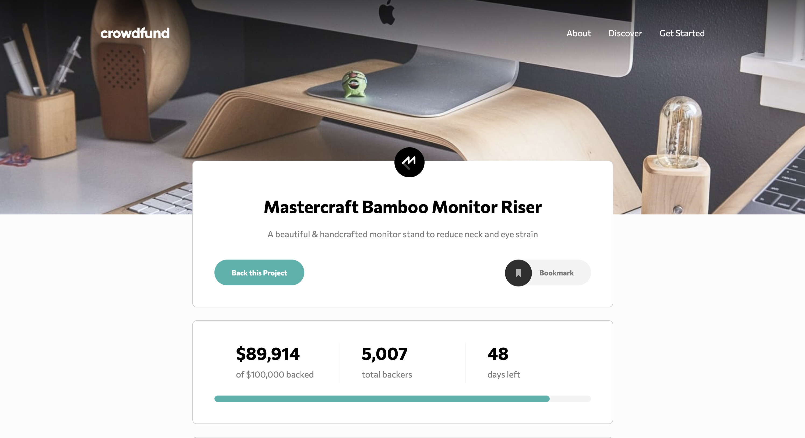

# Frontend Mentor - Crowdfunding product page solution

This is a solution to the [Crowdfunding product page challenge on Frontend Mentor](https://www.frontendmentor.io/challenges/crowdfunding-product-page-7uvcZe7ZR). Frontend Mentor challenges help you improve your coding skills by building realistic projects.

## Table of contents

-   [Overview](#overview)
    -   [The challenge](#the-challenge)
    -   [Screenshot](#screenshot)
    -   [Links](#links)
-   [My process](#my-process)
    -   [Built with](#built-with)
    -   [What I learned](#what-i-learned)
    -   [Continued development](#continued-development)
    -   [Useful resources](#useful-resources)
-   [Author](#author)

## Overview

### The challenge

Users should be able to:

-   View the optimal layout depending on their device's screen size
-   See hover states for interactive elements
-   Make a selection of which pledge to make
-   See an updated progress bar and total money raised based on their pledge total after confirming a pledge
-   See the number of total backers increment by one after confirming a pledge
-   Toggle whether or not the product is bookmarked

### Screenshot



### Links

-   Solution URL: [Github](https://github.com/okori97/crowdfund-project)
-   Live Site URL: [Vercel site](https://crowdfund-project-6mgb.vercel.app/)

## My process

### Built with

-   Semantic HTML5 markup
-   CSS custom properties
-   Flexbox
-   [Webpack](https://www.npmjs.com/package/webpack)
-   [Babel-loader](https://www.npmjs.com/package/babel-loader)
-   [React](https://reactjs.org/) - JS library
-   [Immutability helper](https://www.npmjs.com/package/immutability-helper)

### What I learned

Quite alot.

-   I got to practice passing state between siblings, and dealing with large state objects.
-   I learned that some psuedo elements do not work with `<input>`. Hence I had to wrap my input fields.
-   I learned how to use immutibility helper to modify my nested state objects.
-   I got plenty of practice conditionally rendering/styling components.
-   I also learned about using filter to manipulate svgs. I enjoyed structuring the project, creating a helper folder.
-   File structure
-   CSS file organisation

Code I'm proud of:

```css
/* Using filter to manipulate SVG's was new */
.bookmark.bookmarked > img {
	filter: invert(37%) sepia(15%) saturate(3760%) hue-rotate(136deg) brightness(
			80%
		) contrast(74%);
}
```

```js
//I was pleased to get my effects working with only one dependecy.
useEffect(() => {
	if (pledgeAmount > 0) {
		const updatedProject = update(projectData, {
			fundDetails: {
				amountRaised: {
					$apply: (num) => {
						return num + pledgeAmount * 1;
					},
				},
				totalBackers: {
					$apply: (backers) => {
						return 1 * backers + 1;
					},
				},
			},
			pledgeOptions: {
				$apply: (x) => {
					const test = x.map((item) => {
						if (item == selectedOption) {
							item.pledgesMade++;
						}
					});
					return x;
				},
			},
		});
		setPledgeAmmount(0);
		setSelectedOption(undefined);
		setProjectData(updatedProject);
	}
}, [pledgeAmount]);
```

### Continued development

I want to get more concise and clear with my js logic and html code. I aim to write really lean and readable code. I'm sure the effect could be leaner. Im also not sure I need to destructure as many props as I did. I thought it would be more readable, but I read that, given more than 7~, it's better to use 'props.prop'. I think the css naming could be better.

I also can get better at using css: filter(). I'm not exactly sure how to get my bookmarked button to look exactly like how it needed to, with filter() because i could not see how to select specific colours in a gicen svg to filter.

I plan to develop my file structure too. I understand it's project dependent, to a degree, but I want to practice following best practicies closer.

### Useful resources

-   [CSS Organizing](https://developer.mozilla.org/en-US/docs/Learn/CSS/Building_blocks/Organizing) - This helped me tidy up my App.css file, and think about how to organise my css files better going forward.

-   [File structure](https://blog.webdevsimplified.com/2022-07/react-folder-structure/) - This was a useful article. I had used some of these patterns in previous projects, but there was alot I hadn't done before.

## Author

-   Website - [Okori Lewis-McCalla](https://www.okori.com)
-   Frontend Mentor - [@okori97](https://www.frontendmentor.io/profile/okori97)
-   Twitter - [@onlyokori](https://www.twitter.com/onlyokori)
